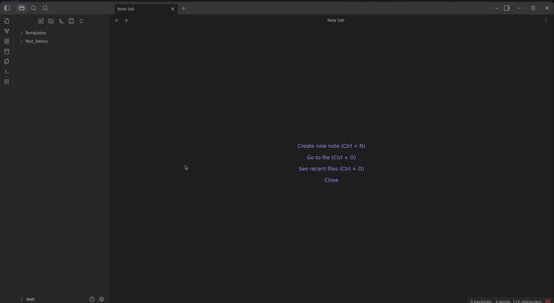

# Templater Dir

An Obsidian plugin for creating files and folders from templates with variable processing.



## Features

- **File Templates**: Create markdown files from templates
- **Folder Templates**: Create complete folder structures with all contents
- **Variable Processing**: Support for date variables and auto-incrementing numbers
- **Flexible Menu**: Choose between grouped or individual template options
- **Template Management**: Hide/show templates and customize their order

## Variables

- `{{date}}` - Current date (2025-08-30)
- `{{dayName}}` - Current day (Friday)
- `{{year}}` - Current year (2025)
- `{{month}}` - Current month (08)
- `{{day}}` - Current day (30)
- `{{time}}` - Current time (14:30)
- `{{hour}}` - Current hour (14)
- `{{minute}}` - Current minute (30)
- `{{weekDay1}}` - Monday
- `{{weekDay2}}` - Tuesday
- `{{weekDay3}}` - Wednesday
- `{{weekDay4}}` - Thursday
- `{{weekDay5}}` - Friday
- `{{weekDay6}}` - Saturday
- `{{weekDay7}}` - Sunday
- `{{uuid}}` - Random UUID (a1b2c3d4-...)
- `{{+Number}}` - Auto-increment (01, 02, 03...)

## Installation

1. Open Settings → Community Plugins
2. Search for "Templater Dir"
3. Install and enable

Or manually: Download and extract to `.obsidian/plugins/templater-dir/`

## Usage

1. Set your templates folder in plugin settings
2. Right-click any folder in your vault
3. Select template option to create files/folders

### Example Template Structure
```
Templates/
├── Daily_{{date}}.md          # Creates: Daily_2025-08-30.md
└── Week_{{+Number}}/          # Creates: Week_01/, Week_02/, etc.
    ├── {{weekDay1}}.md        # Creates: Monday.md
    └── {{weekDay5}}.md        # Creates: Friday.md
```

## Settings

- **Templates folder**: Location of your templates
- **Enable folder templates**: Allow folder structure creation
- **Template variables**: Enable variable processing
- **Menu style**: Grouped (modal) or Individual (direct menu items)
- **Template visibility**: Hide/show and reorder templates (Individual mode)

## Development

```bash
npm install
npm run build    # or npm run dev
```

## License

MIT